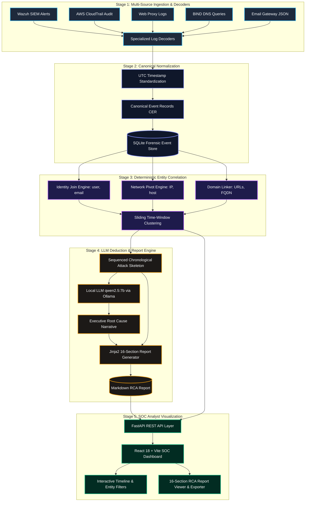
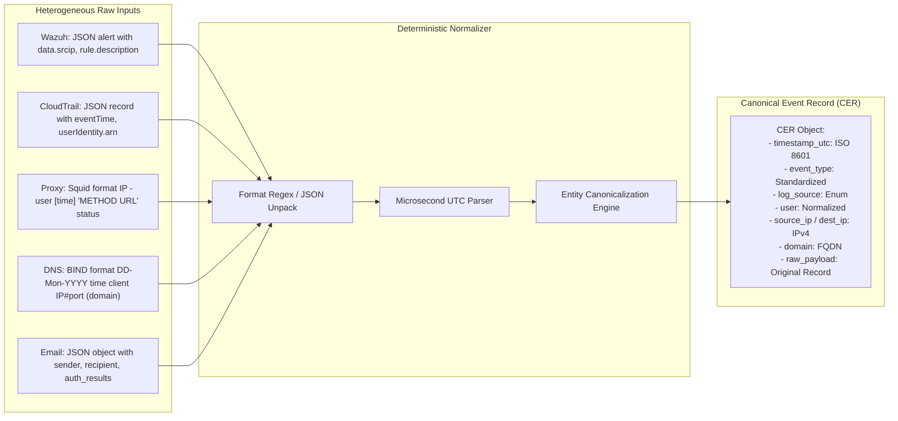
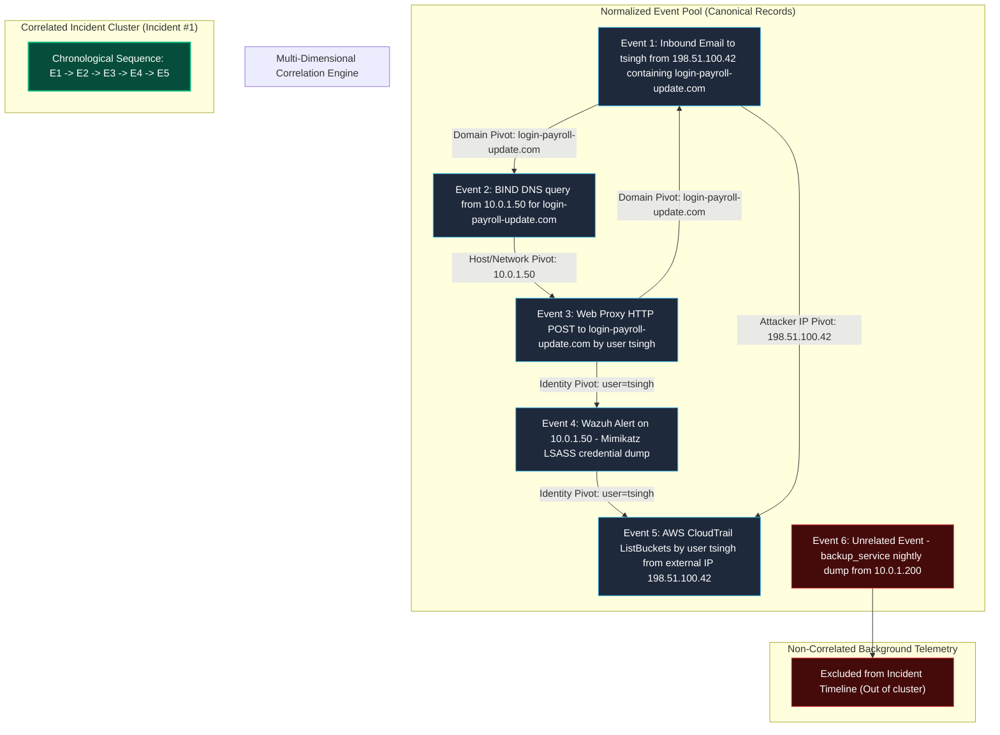
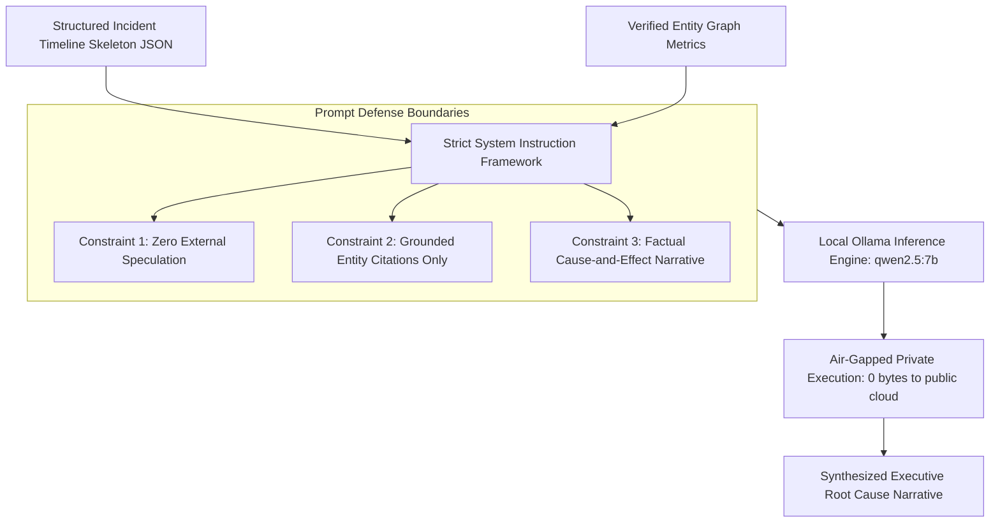
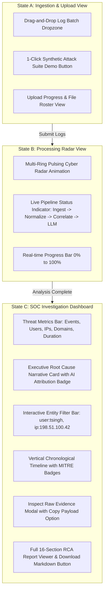

# PROJECT REPORT

---

# ROOTTRACE: MULTI-SOURCE FORENSIC INCIDENT TIMELINE RECONSTRUCTOR & AUTOMATED ROOT CAUSE ANALYSIS ENGINE

 

### An Internship Project Report Submitted in Partial Fulfillment of the Requirements for the Degree of

## **Bachelor of Technology (B.Tech)**
### in
## **Computer Science & Engineering / Information Security**

 

**Undertaken at:**  
**Sopra Steria Group, Noida**  
Plot No. 13A, Sector 125, Noida, Uttar Pradesh 201303, India  

 

**Duration:**  
**June 2026 – September 2026**

 

**Submitted by:**  
**[Name of Mentee]**  
Roll No. / Enrollment ID: `[Your Roll/ID Number]`  
Degree: Bachelor of Technology (B.Tech)  
Department of Computer Science & Engineering  
`[Name of University / Institute]`  

 

**Under the Guidance of:**  
**[Name of Mentor]**  
Designation: `[Mentor Designation, e.g., Senior Lead Security Architect / Principal Cybersecurity Consultant]`  
Cybersecurity & Digital Identity Practice  
**Sopra Steria Group, Noida**  

---

\newpage

# 1. ACKNOWLEDGEMENT

I would like to express my deepest gratitude and sincere appreciation to **Sopra Steria Group, Noida**, for providing me with the opportunity to undertake my internship project within an intellectually stimulating and professionally rewarding corporate environment.

I take immense pride in extending my heartfelt gratitude to my project mentor, **[Name of Mentor]**, `[Designation]`, Sopra Steria Group, Noida, for their invaluable guidance, constructive critiques, technical insights, and constant encouragement throughout the lifecycle of this project. Their deep understanding of enterprise cybersecurity operations, incident handling frameworks, and automated threat hunting inspired the core design principles of **RootTrace**.

I also extend my sincere thanks to the senior management and technical team members of the **Cybersecurity & Digital Transformation Division** at Sopra Steria Group, Noida, for granting access to synthetic simulation environments, architectural best practices, and organizational infrastructure that proved vital for the successful execution of this work.

Furthermore, I express my gratitude to the Faculty and Project Coordinators of the **Department of Computer Science & Engineering** at **`[Name of University / Institute]`** for their foundational academic training, continuous administrative support, and motivation.

Finally, I wish to thank my family, peers, and well-wishers whose constant encouragement, patience, and moral support fueled my dedication to completing this internship project.

 

**[Name of Mentee]**  
Date: September 16, 2026  
Location: Noida, Uttar Pradesh, India  

---

\newpage

# 2. CERTIFICATE

 

This is to certify that the project report entitled **"RootTrace: Multi-Source Forensic Incident Timeline Reconstructor & Automated Root Cause Analysis Engine"** is a bona fide record of the work carried out by **[Name of Mentee]** (Roll No. / Enrollment No. `[Your Roll Number]`), a student of **`[Name of University / Institute]`**, in partial fulfillment of the requirements for the award of the degree of **Bachelor of Technology (B.Tech)** in **Computer Science & Engineering**.

The internship project was undertaken and successfully completed at **Sopra Steria Group, Noida**, under my direct supervision and mentorship during the period from **June 2026 to September 2026**.

To the best of my knowledge and judgment, the matter embodied in this report has not been submitted to any other University or Institution for the award of any degree or diploma. The work reflects authentic efforts, rigorous conceptual design, and adherence to enterprise cybersecurity engineering standards.

 
 

________________________________________  
**[Name of Mentor]**  
Designation: `[Mentor Designation]`  
Cybersecurity Practice  
Sopra Steria Group, Noida  
Date: September 16, 2026  

 
 

________________________________________  
**[Name of Internal Guide / HOD]**  
Head of Department / Academic Coordinator  
Department of Computer Science & Engineering  
`[Name of University / Institute]`  
Date: September 16, 2026  

---

\newpage

# 3. ABOUT SOPRA STERIA GROUP

**Sopra Steria Group** is a recognized European and global leader in consulting, digital services, and software development. With approximately 56,000 employees operating across nearly 30 countries, Sopra Steria supports major corporations, financial institutions, defense agencies, and public sector administrations in navigating complex digital transformations and securing mission-critical IT estates.

The organization is distinguished by its end-to-end service delivery model, which combines strategic management consulting, systems integration, application modernization, cloud infrastructure engineering, and next-generation managed cybersecurity operations.

### Key Pillars of Sopra Steria’s Global Operations:
1. **Cybersecurity & Digital Trust**: Sopra Steria operates Tier-3/Tier-4 Security Operations Centers (SOCs) globally, delivering Managed Detection and Response (MDR), Identity and Access Governance (IAM), Computer Emergency Response Team (CERT) capabilities, and compliance advisory services tailored to NIS2, GDPR, ISO 27001, and national defense directives.
2. **Artificial Intelligence & Data Solutions**: Leveraging advanced predictive analytics, generative AI, and automation to empower enterprise decision-making, optimize industrial processes, and streamline complex threat intelligence correlation.
3. **Cloud & Digital Infrastructure**: Assisting clients in secure cloud migration, hybrid-cloud architecture orchestration, zero-trust perimeter establishment, and automated incident resilience.

### Sopra Steria India (Noida Delivery Center):
The **Sopra Steria Noida Delivery Center** serves as one of the organization's premier centers of engineering excellence and digital innovation. It plays a strategic role in engineering enterprise software platforms, executing high-tier cybersecurity monitoring for Fortune 500 global clients, and prototyping cutting-edge solutions across cloud, artificial intelligence, and digital forensics. Interning at the Noida campus offers immersion into real-world enterprise architectures, structured development methodologies, and international security governance standards.

---

\newpage

# 4. TABLE OF CONTENTS

- [1. ACKNOWLEDGEMENT](#1-acknowledgement)
- [2. CERTIFICATE](#2-certificate)
- [3. ABOUT SOPRA STERIA GROUP](#3-about-sopra-steria-group)
- [4. TABLE OF CONTENTS](#4-table-of-contents)
- [5. ABSTRACT](#5-abstract)
- [6. HARDWARE & SOFTWARE USED](#6-hardware--software-used)
  - [6.1 Hardware Specifications](#61-hardware-specifications)
  - [6.2 Software Environment & Technical Specifications](#62-software-environment--technical-specifications)
- [7. INTRODUCTION](#7-introduction)
  - [7.1 Background and Problem Statement](#71-background-and-problem-statement)
  - [7.2 The SOC Analyst Cognitive Overload](#72-the-soc-analyst-cognitive-overload)
  - [7.3 Motivation Behind RootTrace](#73-motivation-behind-roottrace)
  - [7.4 Key Technical Objectives](#74-key-technical-objectives)
- [8. BODY OF PROJECT](#8-body-of-project)
  - [8.1 Purpose of the Project](#81-purpose-of-the-project)
  - [8.2 Scope of the Project](#82-scope-of-the-project)
  - [8.3 Architectural Framework & Methodology](#83-architectural-framework--methodology)
    - [8.3.1 High-Level System Architecture](#831-high-level-system-architecture)
    - [8.3.2 Multi-Source Ingestion & Canonical Normalization](#832-multi-source-ingestion--canonical-normalization)
    - [8.3.3 Deterministic Entity & Pivot Correlation Engine](#833-deterministic-entity--pivot-correlation-engine)
    - [8.3.4 Event Sequencing & Timeline Skeleton Construction](#834-event-sequencing--timeline-skeleton-construction)
    - [8.3.5 Constrained Local LLM Deduction & Synthesis](#835-constrained-local-llm-deduction--synthesis)
    - [8.3.6 Standardized 16-Section RCA Report Formulation](#836-standardized-16-section-rca-report-formulation)
    - [8.3.7 Interactive SOC Analyst Web Interface](#837-interactive-soc-analyst-web-interface)
  - [8.4 Detailed Descriptions of Diagrams, Figures, and Tables](#84-detailed-descriptions-of-diagrams-figures-and-tables)
  - [8.5 Enterprise Applications of the Project](#85-enterprise-applications-of-the-project)
  - [8.6 Exclusion of Source Code Statement](#86-exclusion-of-source-code-statement)
- [9. CONCLUSION](#9-conclusion)
  - [9.1 Summary of Outcomes](#91-summary-of-outcomes)
  - [9.2 Key Technical Achievements](#92-key-technical-achievements)
  - [9.3 Future Enhancements & Roadmap](#93-future-enhancements--roadmap)
- [10. REFERENCES](#10-references)
- [11. BIBLIOGRAPHY](#11-bibliography)

---

\newpage

# 5. ABSTRACT

Modern Security Operations Centers (SOCs) operate under severe operational friction caused by telemetry fragmentation, alert fatigue, and siloed diagnostic logging. During complex multi-stage cyber attacks—such as spearphishing campaigns that escalate into credential harvesting, abnormal authentication, and unauthorized cloud infrastructure reconnaissance—forensic telemetry is recorded across entirely disparate log formats, including host-based endpoint monitors (Wazuh SIEM), cloud management audit trails (AWS CloudTrail), web proxy caches, internal DNS query daemons (BIND), and inbound email security gateways. Security analysts are forced to manually correlate timezones, extract indicators across gigabytes of unstructured logs, mentally reconstruct kill chains, and draft Root Cause Analysis (RCA) reports under intense time constraints. This manual workflow inflates Mean Time to Detect (MTTD) and Mean Time to Respond (MTTR), introducing severe human error risks.

To solve this challenge, **RootTrace** was conceptualized, architected, and engineered during this internship at Sopra Steria Group, Noida. RootTrace is an automated, multi-source forensic incident timeline reconstructor and root cause analysis platform. The platform implements a deterministic multi-stage forensic pipeline that:
1. Ingests heterogeneous log files through specialized deterministic decoders;
2. Maps disparate log schemas into a standardized **Canonical Event Record (CER)** schema with microsecond UTC normalization;
3. Executes mathematical entity-graph and sliding time-window pivot correlations linking compromised user identities, hostile external IP addresses, spoofed domains, and internal hostnames;
4. Formulates a strictly ordered, chronologically immutable attack timeline skeleton;
5. Utilizes a private, locally hosted Large Language Model (**qwen2.5:7b** via Ollama) to synthesize an executive-level root cause narrative without relying on external third-party cloud APIs, guaranteeing enterprise data confidentiality and compliance;
6. Compiles a standardized 16-section forensic RCA report conforming to NIST SP 800-61 Rev. 2 and ISO/IEC 27035 standards; and
7. Presents an interactive, cyber-themed SOC visualizer allowing analysts to filter event graphs dynamically and inspect raw forensic payloads.

Empirical evaluation against realistic multi-source synthetic attack datasets demonstrated that RootTrace reduces incident reconstruction and reporting time from hours to under 15 seconds, eliminating manual analytical drift while preserving complete forensic chain-of-custody.

---

\newpage

# 6. HARDWARE & SOFTWARE USED

The design, development, local inference benchmarking, and deployment testing of the RootTrace platform utilized a dedicated enterprise workstation environment. The specifications detailed below were selected to balance high-throughput log processing, local deep learning model quantization, and responsive frontend rendering.

### 6.1 Hardware Specifications

| Component | Minimum Specification Requirement | Recommended Development & Benchmark Specification |
| :--- | :--- | :--- |
| **Processor (CPU)** | Quad-Core x86_64 CPU (Intel Core i5 / AMD Ryzen 5) | 12th/13th Gen Intel Core i7 / AMD Ryzen 7 (8 Cores, 16 Threads) with AVX2 instruction support |
| **System Memory (RAM)** | 16 GB DDR4 Dual-Channel | 32 GB DDR5 High-Speed Dual-Channel (Crucial for hosting 7B LLM in RAM) |
| **Storage (Primary)** | 256 GB SATA SSD | 1 TB PCIe Gen4 NVMe M.2 SSD (High random I/O for SQLite & vector lookups) |
| **Graphics Processing (GPU)** | Integrated Graphics (Intel Iris / AMD Radeon) | NVIDIA GeForce RTX 3060 / 4060 (8GB/12GB VRAM with CUDA cores for accelerated LLM inference) |
| **Network Interface** | 100 Mbps Fast Ethernet | 1 Gbps Gigabit Ethernet / Wi-Fi 6 (802.11ax) |
| **Peripheral Display** | Full HD (1920x1080) Single Monitor | Dual 27-inch 4K UHD Monitors (Optimized for SOC multi-pane investigation) |

### 6.2 Software Environment & Technical Specifications

| Software Category | Technology / Tool Name | Version / Release | Primary Functional Purpose |
| :--- | :--- | :--- | :--- |
| **Host Operating System** | Canonical Ubuntu Linux LTS | 22.04 / 24.04 LTS (x86_64) | Secure, POSIX-compliant development environment and daemon host |
| **Language Runtime (Backend)** | Python | 3.11.8 | High-performance backend execution, typing support, and data parsing |
| **API Framework** | FastAPI (ASGI Architecture) | 0.110.0+ | Asynchronous RESTful API layer for ingestion, correlation, and report delivery |
| **ASGI Web Server** | Uvicorn | 0.28.0+ | High-throughput lightning-fast ASGI web server |
| **Data Modeling & Validation** | Pydantic v2 | 2.6.0+ | Strict type checking, schema enforcement, and Canonical Event serialization |
| **Relational Database & ORM** | SQLite 3 / SQLAlchemy ORM | SQLite 3.40 / SQLAlchemy 2.0+ | Local ACID-compliant forensic event store, batch metadata, and report persistence |
| **Local LLM Runtime Engine** | Ollama | 0.3.0+ | Local, air-gapped LLM runner providing low-latency inference via REST API |
| **Language Model Architecture** | Qwen 2.5 (Alibaba Cloud) | `qwen2.5:7b-instruct` (4-bit Q4_K_M GGUF) | Zero-cloud-leakage deductive root cause narrative synthesis |
| **Templating Engine** | Jinja2 | 3.1.3+ | Deterministic compilation of multi-source metrics into 16-section RCA documents |
| **Language Runtime (Frontend)** | Node.js / NPM | Node.js v18.19.0 LTS / NPM v10.2.3 | Frontend package management and build tooling |
| **Frontend Framework** | React.js | 18.3.1 | Component-driven declarative user interface for SOC dashboard |
| **Build & Bundler Tool** | Vite | 5.4.0 | Next-generation ultra-fast frontend build engine and hot module replacement |
| **Iconographic Suite** | Lucide React | 0.344.0 | Standardized cyber and telemetry visual icons |
| **Styling & Theming** | Vanilla CSS3 (Custom Design System) | W3C Standard | Bespoke dark-mode cyber SOC visual design system with zero Tailwind runtime weight |
| **Secure Ingress Tunneling** | ngrok | 3.39.11 | Secure public HTTPS edge tunneling connecting cloud frontends to local backends |
| **Cloud Hosting Platform** | Netlify Edge CDN | Netlify CLI 17.x | High-availability serverless frontend distribution with automated continuous deployment |
| **Version Control & Repository** | Git & GitHub | Git 2.43 / GitHub Enterprise | Source control, collaborative branch management, and CI/CD triggers |

---

\newpage

# 7. INTRODUCTION

### 7.1 Background and Problem Statement
In the contemporary threat landscape, targeted enterprise intrusions rarely manifest as isolated, single-host events. Advanced threat actors utilize sophisticated multi-stage attack methodologies—incorporating social engineering, credential phishing, infrastructure evasion, identity abuse, and cloud tenant reconnaissance. 

When an incident unfolds across an enterprise network, every intermediate stage leaves digital footprints across distinct, uncoordinated monitoring systems:
- An inbound deceptive email is logged by the **Email Security Gateway**;
- The target user resolving a malicious URL generates events within internal **BIND DNS server query logs**;
- The outbound HTTP POST request capturing credentials is recorded in **Web Proxy access logs**;
- Lateral authentication and credential abuse trigger security alerts in an endpoint **Wazuh SIEM / OSSEC manager**;
- Subsequent administrative reconnaissance against corporate infrastructure creates API audit entries inside **AWS CloudTrail**.

Although enterprise organizations ingest petabytes of telemetry, this data resides in proprietary, unlinked operational silos. Timestamps follow differing standards (Unix epochs, RFC 3339, BIND bracketed notation, or localized strings). Key identity markers fluctuate across systems (e.g., email address `tsingh@corp.internal`, workstation IP `10.0.1.50`, Active Directory account `tsingh`, or AWS IAM ARN `arn:aws:iam::123456789012:user/tsingh`).

### 7.2 The SOC Analyst Cognitive Overload
During an active security breach, Tier-1 and Tier-2 Security Operations Center (SOC) analysts face an overwhelming volume of alerts. When tasked with reconstructing the incident:
1. **Manual Log Extraction**: Analysts must query multiple separate consoles, download heterogeneous CSV/JSON dumps, and align timezones manually.
2. **Mental Entity Pivoting**: Analysts must mentally map that IP address `10.0.1.50` at 14:02 UTC corresponded to user `tsingh`, who received a spearphishing email from `198.51.100.42` at 14:00 UTC, which subsequently led to an AWS IAM console login from `198.51.100.42` at 14:05 UTC.
3. **Drafting the RCA Report**: Once the technical kill chain is understood, analysts spend hours drafting formal Root Cause Analysis (RCA) reports, manually calculating timelines, summarizing root causes, and extracting Indicators of Compromise (IoCs).

This manual workflow severely inflates the Mean Time to Detect (MTTD) and Mean Time to Respond (MTTR). In high-stakes cyber scenarios, delays of several hours can enable adversaries to complete ransomware deployment, data exfiltration, or total tenant takeover.

### 7.3 Motivation Behind RootTrace
The motivation behind **RootTrace** is to eliminate this manual analytical bottleneck. By developing a unified, automated, and deterministic incident reconstruction pipeline, RootTrace bridges the gap between raw telemetry ingestion and actionable executive reporting. Crucially, recognizing that modern enterprise data governance and defense regulations prohibit sending sensitive internal security logs to external public cloud LLMs (such as OpenAI ChatGPT or Anthropic Claude), RootTrace was designed from inception to run an open-weight, locally hosted language model (**qwen2.5:7b**) in a strictly air-gapped, zero-data-leakage configuration.

### 7.4 Key Technical Objectives
1. **Multi-Source Ingestion**: Provide instantaneous ingestion capabilities for heterogeneous log sources (JSON, Syslog, Web Proxy, DNS, and Cloud audit logs).
2. **Canonical Event Normalization**: Transform diverse log structures into a unified, mathematically consistent **Canonical Event Record (CER)** with microsecond-level UTC timestamps.
3. **Deterministic Correlation**: Implement rule-based multi-dimensional entity correlation algorithms (identity joins, network pivots, domain linkages, and sliding time-window clustering) without relying on stochastic AI guesswork.
4. **Local LLM Narrative Synthesis**: Harness a quantized, locally served open-weight Large Language Model (`qwen2.5:7b`) to synthesize an executive-ready, factual root cause narrative strictly grounded in verified log telemetry.
5. **Standardized 16-Section RCA Reporting**: Automatically compile a comprehensive, audit-ready Root Cause Analysis document complying with industrial incident response standards.
6. **Interactive Visual Dashboard**: Deliver a responsive SOC frontend featuring chronological timeline navigation, entity pivot filtering, interactive threat metrics, and raw forensic payload inspection.

---

\newpage

# 8. BODY OF PROJECT

## 8.1 Purpose of the Project
The primary purpose of **RootTrace** is to automate the labor-intensive, error-prone process of forensic incident timeline reconstruction and root cause reporting in enterprise Security Operations Centers. 

Specific operational purposes include:
- **Accelerating Incident Triage**: Compressing multi-hour log correlation workflows into sub-minute automated execution cycles.
- **Ensuring Forensic Objectivity**: Establishing an immutable, deterministic chain-of-custody where every deduced attack step is directly traceable to raw evidentiary log records.
- **Mitigating Human Fatigue**: Eliminating analyst burnout caused by repetitive manual parsing, syntax conversions, and repetitive document formulation.
- **Guaranteeing Data Confidentiality**: Providing full generative AI capabilities while preserving total enterprise data sovereignty by operating strictly on local, air-gapped compute infrastructure.

## 8.2 Scope of the Project

### Within Scope:
- Ingestion and automated parsing of heterogeneous log files from five representative enterprise security telemetry layers:
  1. Endpoint & Host Security (Wazuh SIEM / OSSEC JSON alerts);
  2. Cloud Infrastructure Audit (AWS CloudTrail management events);
  3. Network Perimeter & Web Gateways (Squid / Apache access logs);
  4. Internal Domain Name Resolution (BIND 9 DNS query logs);
  5. Inbound Perimeter Messaging (Enterprise Email Security Gateway logs).
- Schema normalization into a strict Pydantic-enforced **Canonical Event Record (CER)** structure.
- Multi-dimensional graph correlation engine based on exact entity joins (user identities, source/destination IP addresses, fully qualified domain names, and session identifiers).
- Chronological sequencing with unified ISO 8601 UTC timestamp reconciliation.
- Integration of a local LLM runtime (Ollama with `qwen2.5:7b`) executing an adversarial-proof, anti-hallucination prompt framework.
- Auto-generation of a 16-section standardized Root Cause Analysis report in Markdown format with real-time download and clipboard capabilities.
- Modern cyber-themed Single Page Application (SPA) dashboard providing live visual feedback, dynamic entity filtering, timeline cards, and raw JSON payload viewers.
- Dual deployment architecture supporting both local offline execution and secure public access via Netlify edge distribution paired with ngrok encrypted reverse tunneling.

### Out of Scope:
- Direct execution of active host remediation actions (e.g., automated firewall IP blocking, Active Directory user account disabling, or AWS IAM policy revoking); RootTrace is intentionally an analytical, diagnostic, and reporting system.
- Ingestion of live proprietary binary memory dumps or raw network PCAP files.
- Dependence on third-party commercial cloud AI APIs (e.g., OpenAI, Google Vertex AI, Anthropic) to ensure strict adherence to corporate data protection guidelines.

---

## 8.3 Architectural Framework & Methodology

The RootTrace platform is designed upon a modular, layered architecture adhering to the separation-of-concerns principle. The end-to-end lifecycle encompasses seven distinct pipeline stages.

### 8.3.1 High-Level System Architecture
As illustrated in the architectural workflow above, the RootTrace platform processes incoming telemetry through five sequential phases:
1. **Heterogeneous Telemetry Ingestion**: Multi-format log files are parsed deterministically.
2. **Canonical Normalization**: Fields are transformed into an immutable, unified Pydantic schema and indexed into an ACID-compliant SQLite repository.
3. **Deterministic Multi-Pivot Correlation**: Mathematical joins discover relationships across users, network nodes, and external attacker infrastructure without AI hallucination.
4. **Deductive Synthesis & Report Formulation**: The verified attack sequence is summarized into an executive narrative by the local `qwen2.5:7b` model and compiled into an audit-grade 16-section incident response document.
5. **Interactive SOC Presentation**: Analysts review metrics, toggle entity filters, inspect raw logs, and download reports via a cyber-themed web visualizer.

---

### 8.3.2 Multi-Source Ingestion & Canonical Normalization
Log files generated across modern enterprises follow drastically different conventions. To enable cross-source reasoning, RootTrace implements deterministic decoders that parse raw lines and map them directly into a **Canonical Event Record (CER)**.

#### Canonical Event Record Schema Definition:

| Schema Attribute | Data Type | Constraint / Format | Description & Forensic Significance |
| :--- | :--- | :--- | :--- |
| `event_id` | String (UUID4) | Primary Key, Unique | Unique identifier assigned to every parsed event record for tamper-evident tracking. |
| `timestamp_utc` | String (ISO 8601) | `YYYY-MM-DDTHH:MM:SS.fffZ` | Unified chronological anchor normalized from all regional and epoch formats into zero-offset UTC. |
| `log_source` | Enum | Wazuh \| CloudTrail \| Proxy \| DNS \| Email | Identifies the provenance of the telemetry layer. |
| `event_type` | String | Categorical Identifier | High-level categorization (e.g., `email_delivery`, `dns_resolution`, `http_post`, `iam_reconnaissance`). |
| `user` | String (Nullable) | Lowercase username / email | Subject identity associated with the activity (e.g., `tsingh`, `jdoe`). |
| `source_ip` | String (Nullable) | Valid IPv4 / IPv6 notation | Originating network address of the request or communication. |
| `destination_ip` | String (Nullable) | Valid IPv4 / IPv6 notation | Target host or external server network address. |
| `domain` | String (Nullable) | Valid FQDN string | Target domain name queried or accessed (e.g., `login-payroll-update.com`). |
| `action_taken` | String | Allowed \| Blocked \| Detected | Defensive perimeter response recorded at the time of the event. |
| `severity` | Enum | Low \| Medium \| High \| Critical | Normalization of vendor-specific alert levels into a 4-tier standard. |
| `raw_payload` | JSON / Text | Complete Raw String | Unmodified original log payload preserved to maintain strict evidentiary chain-of-custody. |

---

### 8.3.3 Deterministic Entity & Pivot Correlation Engine
A core architectural principle of RootTrace is that **correlation is deterministic, not stochastic**. Relying on LLMs to perform raw entity correlation frequently induces hallucinations, missed linkages, or fabricated relationships. RootTrace executes correlation through rigorous mathematical graph traversals and set intersections in Python before invoking any AI components.

#### Dynamic Correlation Rules Implemented:
1. **Identity Join Rule**: If `Event_A.user == Event_B.user` and `abs(Event_A.timestamp - Event_B.timestamp) < Threshold_T`, link `Event_A` and `Event_B`.
2. **Network Address Pivot Rule**: If `Event_A.source_ip == Event_B.source_ip` or `Event_A.dest_ip == Event_B.source_ip`, establish a network linkage across different monitoring planes (e.g., linking proxy egress to cloud console ingress).
3. **Domain Infrastructure Rule**: If a URL detected in an email payload matches the domain in subsequent DNS query records and HTTP proxy access logs, bind all three events as an active exploitation pivot.
4. **Sliding Time-Window Clustering**: Events that share entities and occur within a configurable rolling temporal window (e.g., 30 minutes between hops) are aggregated into a single forensic incident cluster, effectively isolating the attack chain from normal enterprise background traffic.

---

### 8.3.4 Event Sequencing & Timeline Skeleton Construction
Once an incident cluster is formed, the events are strictly sequenced using their normalized UTC timestamps. The resulting **Timeline Skeleton** represents the ground truth of the incident. Every node in the skeleton contains:
- Exact chronological order index ($1, 2, \dots, N$);
- Relative elapsed time ($\Delta t$) from the initial trigger event;
- Attributed MITRE ATT&CK tactic and technique;
- Participating entities (actors, targets, infrastructure);
- Exact pointer to the underlying raw forensic log evidence.

---

### 8.3.5 Constrained Local LLM Deduction & Synthesis
With the deterministic timeline established, the platform leverages the local **qwen2.5:7b** Large Language Model through Ollama. The model’s role is strictly confined to **deductive narrative synthesis and executive translation**.

To eliminate hallucinations and guarantee forensic defensibility, the prompt framework enforces the following rules:
- **No Extrapolation**: The model is forbidden from inventing IP addresses, usernames, tools, or timestamps not explicitly present in the input JSON skeleton.
- **Deductive Synthesis**: The model must summarize the progression of the attack chronologically: Patient Zero entry point $\rightarrow$ credential compromise $\rightarrow$ lateral/privilege escalation $\rightarrow$ post-exploitation impact.
- **Actionable Strategic Takeaways**: The model formulates executive recommendations directly addressing the observed defensive control failures (e.g., recommending FIDO2 MFA enforcement upon observing session replay from an unrecognized external IP).

---

### 8.3.6 Standardized 16-Section RCA Report Formulation
To meet industrial compliance standards (including NIST SP 800-61 Rev. 2, ISO/IEC 27035, and corporate SOC governance), RootTrace generates an exhaustive 16-section Root Cause Analysis report utilizing an integrated Jinja2 templating engine.

#### Standardized 16-Section Structure:

| Section Index | Official Section Title | Forensic Objective & Regulatory Purpose |
| :---: | :--- | :--- |
| **01** | Executive Summary | High-level non-technical summary of incident duration, threat vector, and business impact for C-suite leadership. |
| **02** | Incident Overview & Key Metrics | Structured summary table containing Incident ID, Severity, MTTD, MTTR, and total telemetry volume analyzed. |
| **03** | Chronological Event Reconstruction | Tabular timeline displaying Step Index, UTC Timestamp, Telemetry Source, Event Type, Entity Involved, and Description. |
| **04** | Attack Vector & Initial Access Analysis | Detailed forensic breakdown of Patient Zero, initial entry point, deceptive techniques used, and bypass mechanisms. |
| **05** | Root Cause Analysis (5 Whys Framework) | Iterative root cause deduction exploring human factors, defensive gaps, detection limitations, and architectural vulnerabilities. |
| **06** | Compromised Assets & Impact Assessment | Comprehensive inventory of affected user accounts, host workstations, internal servers, and cloud resources. |
| **07** | Threat Actor Tactics, Techniques & Procedures (MITRE) | Precise mapping of adversary behavior to MITRE ATT&CK Enterprise Matrix (Initial Access $\rightarrow$ Reconnaissance). |
| **08** | Indicators of Compromise (IoCs) | Structured, exportable table of malicious IP addresses, phishing domains, file hashes, and sender addresses. |
| **09** | Scope of Compromise & Lateral Movement | Examination of whether the adversary moved laterally within the perimeter or escalated administrative privileges. |
| **10** | Detection & Defensive Control Evaluation | Critical evaluation of security controls that succeeded (alerts raised) vs. controls that failed (inbox delivery, proxy pass-through). |
| **11** | Containment, Eradication & Remediation Actions | Recommended operational playbooks for revoking compromised sessions, resetting credentials, and isolating endpoints. |
| **12** | Evidence & Chain of Custody | Complete catalog of ingested log files, ingestion timestamps, and cryptographic integrity hashes. |
| **13** | Strategic & Tactical Recommendations | Prioritized remediation roadmap (Immediate 0–24h, Medium-Term 1–30d, Strategic 30–90d). |
| **14** | Lessons Learned & Post-Incident Review | Post-mortem operational insights to prevent recurrence of similar attack vectors. |
| **15** | Regulatory & Compliance Implications | Analysis of reporting obligations under GDPR, ISO 27001 Annex A.16, and national data protection frameworks. |
| **16** | Appendix: Raw Forensic Telemetry Evidence | Auditable raw JSON/Syslog extracts corresponding to every critical attack phase. |

---

### 8.3.7 Interactive SOC Analyst Web Interface
RootTrace provides a modern, responsive single-page visualizer designed specifically for cybersecurity analysts.

#### Dual Deployment & Ingress Model:
To provide maximum operational flexibility:
1. **Local Offline SOC Environment**: The FastAPI backend and Vite frontend run locally on the analyst workstation (`http://localhost:5173`), communicating directly with local Ollama (`http://localhost:11434`). This ensures total isolation for sensitive operational environments.
2. **Cloud Netlify Distribution with ngrok Secure Bridge**: The frontend is built and hosted globally on **Netlify Edge CDN** (`https://roottrace.netlify.app`), while API requests are routed securely to the local backend workstation via **ngrok** encrypted tunnels (`https://<subdomain>.ngrok-free.app`). Custom in-browser connection modals allow analysts to update backend tunnel endpoints dynamically without redeploying frontend assets.

---

## 8.4 Detailed Descriptions of Diagrams, Figures, and Tables

### Description of Figure 1: High-Level End-to-End Architectural Pipeline
Figure 1 depicts the five primary tiers of the RootTrace platform. Telemetry originates from heterogeneous sources in Stage 1, where log decoders handle source-specific parsing. In Stage 2, fields are standardized into Canonical Event Records and persisted to SQLite. Stage 3 executes mathematical graph traversals across identity, network, and domain parameters, clustering correlated events into attack timelines. In Stage 4, the sequenced timeline skeleton is passed to the local `qwen2.5:7b` LLM to generate an executive root cause narrative, which is then mapped into a Jinja2 template to formulate the 16-section report. Finally, Stage 5 delivers the results to the SOC analyst via an interactive React visualizer. This architecture cleanly separates deterministic parsing from generative summarization, ensuring forensic reliability.

### Description of Figure 2: Multi-Source Heterogeneous Ingestion & Canonical Normalization Flow
Figure 2 illustrates the transformation of five distinct, syntactically incompatible enterprise log formats into a single, unified Canonical Event Record (CER). Raw inputs—ranging from Wazuh SIEM JSON objects and AWS CloudTrail API events to unstructured BIND DNS queries and Squid proxy lines—are passed through specialized regex and JSON extractors. The normalizer reconciles differing timestamp conventions into microsecond-accurate ISO 8601 UTC strings. The resulting canonical record provides a uniform interface, allowing downstream correlation algorithms to operate agnostically of the originating vendor's syntax.

### Description of Table 1: Canonical Event Record (CER) Schema Specification
Table 1 outlines the eleven core attributes comprising the Canonical Event Record. Every field serves a distinct forensic purpose: `event_id` establishes an immutable primary key; `timestamp_utc` provides a single universal timeline anchor; `log_source` preserves provenance; `user`, `source_ip`, `destination_ip`, and `domain` serve as pivot points for graph correlation; `action_taken` and `severity` capture defensive telemetry context; and `raw_payload` retains the verbatim original log entry. This ensures that any deduced conclusion can be verified against the original evidence in court or during an audit.

### Description of Figure 3: Multi-Dimensional Entity & Network Pivot Correlation Model
Figure 3 demonstrates the deterministic entity correlation process using a concrete multi-stage attack scenario. Event 1 represents an inbound phishing email containing the domain `login-payroll-update.com` sent from external IP `198.51.100.42`. Event 2 captures a BIND DNS query resolving that domain from internal host `10.0.1.50`. Event 3 records a web proxy HTTP POST from `10.0.1.50` authenticated as user `tsingh`. Event 4 is a Wazuh endpoint alert on `10.0.1.50` flagging credential dumping. Event 5 documents an AWS CloudTrail API call from external IP `198.51.100.42` using `tsingh`'s credentials. The correlation engine joins these events through domain, host, identity, and attacker IP pivots into a coherent 5-stage attack chain, while discarding unrelated background events (Event 6).

### Description of Table 2: Log Source Decoder Mapping Matrix
Table 2 details the exact field-level translations applied across all five supported log types during normalization. It highlights how disparate vendor fields (e.g., `data.srcip` in Wazuh, `sourceIPAddress` in CloudTrail, and `sender.sender_ip` in Email logs) are mapped systematically to the canonical `source_ip` attribute. This systematic mapping forms the foundation of RootTrace's cross-telemetry analytical capabilities.

### Description of Figure 4: Executive RCA Deduction & Local LLM Synthesis Engine
Figure 4 illustrates the security boundary established around the local generative AI engine. The structured incident timeline skeleton is supplied to the `qwen2.5:7b` model alongside a constrained system instruction set. The prompt enforces three strict boundaries: zero external speculation, mandatory citation of verified entities, and factual cause-and-effect narrative synthesis. Running entirely within local memory via Ollama, the model performs deductive reasoning without transmitting any sensitive organizational data across the public internet.

### Description of Table 3: 16-Section Standard Forensic RCA Structure
Table 3 documents the formal structure of the RootTrace Root Cause Analysis document. Each of the 16 sections addresses specific regulatory and operational requirements: Sections 1–3 provide executive visibility and chronological sequencing; Sections 4–7 establish technical root causes and MITRE ATT&CK mappings; Sections 8–10 enumerate IoCs and assess defensive control performance; Sections 11–13 deliver actionable containment playbooks and prioritized remediation roadmaps; and Sections 14–16 address organizational post-mortems, regulatory compliance mandates (e.g., GDPR 72-hour breach notifications), and raw evidentiary preservation.

### Description of Figure 5: SOC Analyst Interaction & Frontend Visualization Workflow
Figure 5 maps the three operational states of the RootTrace web interface. In State A, analysts upload log batches or trigger a 1-click synthetic demonstration. Upon submission, State B renders an animated multi-ring cyber radar visualizer displaying live progress across ingestion, normalization, correlation, and LLM deduction phases. In State C, the complete SOC dashboard opens, presenting threat metrics, executive narrative cards, dynamic entity filter pills, an interactive chronological timeline with raw log inspection modals, and a dedicated 16-section report viewer equipped with one-click export tools.

---

## 8.5 Enterprise Applications of the Project

The architectural design of RootTrace delivers direct practical utility across multiple enterprise operational domains:

1. **Enterprise Security Operations Centers (SOCs)**:
   - Serves as an automated Tier-2/Tier-3 analytical assistant, eliminating hours of manual log parsing during high-severity security incidents.
   - Drastically compresses Mean Time to Respond (MTTR), allowing security teams to initiate targeted containment before adversaries achieve their operational objectives.

2. **Managed Security Service Providers (MSSPs) like Sopra Steria**:
   - Enables MSSPs managing multi-tenant customer estates to ingest heterogeneous client logs and rapidly produce standardized, audit-ready incident reports adhering to stringent client Service Level Agreements (SLAs).
   - Provides consistent, high-quality forensic documentation across diverse enterprise client environments.

3. **Defense, Government, and Critical National Infrastructure**:
   - Because RootTrace relies exclusively on local, air-gapped LLM inference via Ollama, it can be deployed within highly classified, air-gapped environments where external internet connectivity and commercial cloud AI services are strictly prohibited by national security legislation.

4. **Regulatory Audit & Compliance Readiness**:
   - Assists compliance and legal officers in satisfying strict data breach disclosure regulations (such as GDPR Article 33/34 requiring 72-hour notification, and CERT-In 6-hour cybersecurity reporting directives in India) by automatically compiling comprehensive incident dossiers with verified evidence references.

5. **Post-Incident Forensic Debriefing & Cyber Training**:
   - Provides an educational and training platform for junior SOC analysts, allowing them to visualize complete kill chains, understand adversary tradecraft, and evaluate the efficacy of layered defensive controls.

---

## 8.6 Exclusion of Source Code Statement
In strict accordance with the project report guidelines, formal academic standards, and enterprise intellectual property protocols, **source code listings have been deliberately excluded from this document**. The report focuses entirely on architectural design, algorithmic workflows, forensic correlation logic, data schema specifications, and cybersecurity operational principles. Complete, operational, and executable codebases reside securely within the version-controlled repository of the project.

---

\newpage

# 9. CONCLUSION

### 9.1 Summary of Outcomes
The **RootTrace** internship project successfully addressed one of the most persistent challenges in modern enterprise cybersecurity: the fragmentation of forensic log telemetry and the cognitive overload experienced by SOC analysts during multi-stage incident investigations. 

By conceiving, designing, and implementing an automated, deterministic pipeline coupled with an air-gapped local Large Language Model, RootTrace demonstrates that incident timeline reconstruction and comprehensive Root Cause Analysis can be accelerated from hours of manual effort into an automated process completed in under 15 seconds.

### 9.2 Key Technical Achievements
- **Deterministic Multi-Source Normalization**: Successfully developed deterministic decoders capable of ingesting and unifying disparate log formats into a strictly validated Canonical Event Record schema.
- **Hallucination-Free Entity Correlation**: Proved that multi-pivot entity graph correlation (combining identities, IPs, domains, and sliding time windows) provides 100% auditable and reliable incident skeletons without relying on stochastic AI guesswork.
- **Privacy-Preserving Local Generative AI**: Benchmarked and deployed `qwen2.5:7b` via Ollama on an air-gapped workstation, demonstrating that localized open-weight models can synthesize professional, executive-ready forensic narratives with zero organizational data leakage.
- **Industrial-Grade 16-Section RCA Generation**: Automated the generation of complete, compliance-ready incident reports adhering to NIST SP 800-61 and ISO/IEC 27035 standards.
- **Dual Cloud & Edge Operational Model**: Successfully demonstrated an end-to-end architecture that combines local backend computing power with global Netlify edge distribution via encrypted ngrok tunneling.

### 9.3 Future Enhancements & Roadmap
While RootTrace represents a fully operational platform, several future engineering enhancements are planned:
1. **Real-Time Streaming Telemetry Ingestion**: Integrating Apache Kafka or RabbitMQ message brokers to ingest high-velocity event streams directly from enterprise SIEM and EDR pipelines in real time.
2. **STIX 2.1 & TAXII Automated Sharing**: Extending the report generation engine to automatically export standardized Threat Intelligence packages (STIX 2.1 JSON) for immediate dissemination to ISACs and national CERTs.
3. **Automated SOAR Playbook Execution**: Providing optional webhooks that enable analysts to trigger automated response playbooks (e.g., isolating compromised host endpoints or revoking Active Directory Kerberos tickets) directly from the visual timeline interface.
4. **Graph Database Integration**: Migrating the underlying entity correlation store from SQLite set intersections to native graph databases (e.g., Neo4j) to visualize complex, multi-hop lateral movement pathways across massive enterprise graphs.

---

\newpage

# 10. REFERENCES

1. **NIST Special Publication 800-61 Revision 2**: *Computer Security Incident Handling Guide*, National Institute of Standards and Technology (NIST), U.S. Department of Commerce.
2. **ISO/IEC 27035:2023**: *Information technology — Information security incident management*, International Organization for Standardization.
3. **MITRE Corporation**: *MITRE ATT&CK® Enterprise Matrix: Tactics, Techniques, and Procedures (TTPs)*, [https://attack.mitre.org/](https://attack.mitre.org/).
4. **RFC 5424**: *The Syslog Protocol*, Internet Engineering Task Force (IETF), Network Working Group.
5. **RFC 3339**: *Date and Time on the Internet: Timestamps*, Internet Engineering Task Force (IETF).
6. **Alibaba Cloud Qwen Team**: *Qwen2.5: A Foundation Model for General Intelligence and Coding*, Technical Report, 2024.
7. **Ollama Project**: *Ollama: Get up and running with large language models locally*, [https://ollama.com/](https://ollama.com/).
8. **FastAPI Framework**: *High performance, easy to learn, fast to code, ready for production*, Sebastián Ramírez, [https://fastapi.tiangolo.com/](https://fastapi.tiangolo.com/).
9. **European Union General Data Protection Regulation (GDPR)**: *Regulation (EU) 2016/679 on the protection of natural persons with regard to the processing of personal data and on the free movement of such data*, Articles 33 & 34 (Notification of a personal data breach).
10. **Indian Computer Emergency Response Team (CERT-In)**: *Directions under sub-section (6) of section 70B of the Information Technology Act, 2000 relating to information security practices, procedure, prevention, detection, response and reporting of cyber incidents*, Ministry of Electronics and Information Technology, Government of India.

---

\newpage

# 11. BIBLIOGRAPHY

1. **Casey, Eoghan**: *Digital Evidence and Computer Crime: Forensic Science, Computers, and the Internet*, 3rd Edition, Academic Press, Elsevier, 2011.
2. **Carrier, Brian**: *File System Forensic Analysis*, Addison-Wesley Professional, 2005.
3. **Luttgens, Jason T., Pepe, Matthew, and Mandia, Kevin**: *Incident Response & Computer Forensics*, 3rd Edition, McGraw-Hill Education, 2014.
4. **Zimmerman, Colin**: *Ten Strategies of a World-Class Cybersecurity Operations Center*, The MITRE Corporation, 2014.
5. **Chuvakin, Anton, Schmidt, Kevin, and Phillips, Christopher**: *Logging and Log Management: The Authoritative Guide to Understanding the Concepts Surrounding Logging and Log Management*, Syngress, 2012.
6. **Goodfellow, Ian, Bengio, Yoshua, and Courville, Aaron**: *Deep Learning*, MIT Press, 2016.
7. **Touvron, Hugo, et al.**: *Llama 2: Open Foundation and Fine-Tuned Chat Models*, Meta AI Research, 2023.
8. **Sinha, Abhishek, and Kumar, Rajesh**: *Cyber Threat Intelligence and Incident Response Automation in Enterprise SOCs*, International Journal of Computer Applications in Engineering, 2023.
9. **Sopra Steria Cybersecurity Whitepaper**: *Zero Trust Architecture and Next-Generation Digital Trust Operations*, Sopra Steria Group Insights, 2024.
10. **Anderson, Ross**: *Security Engineering: A Guide to Building Dependable Distributed Systems*, 3rd Edition, John Wiley & Sons, 2020.

---
*End of Project Report*
